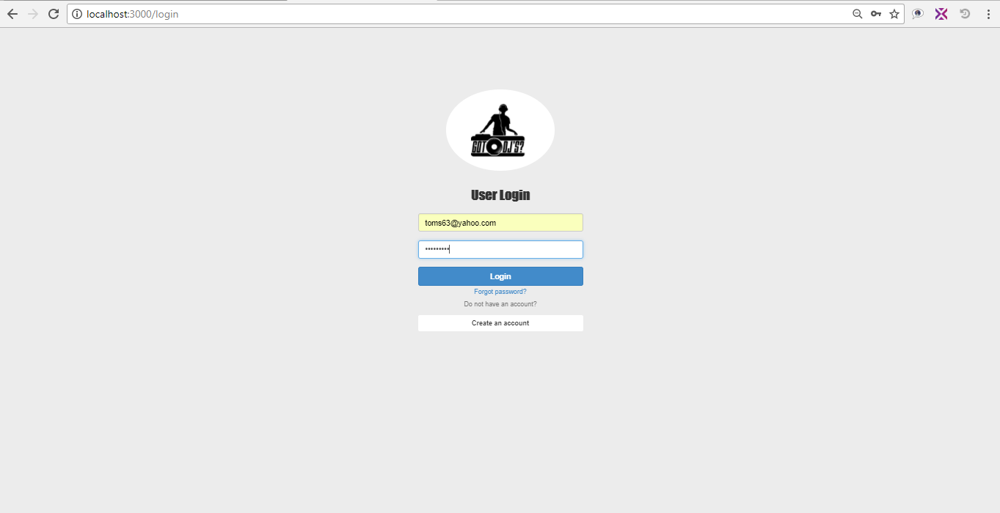
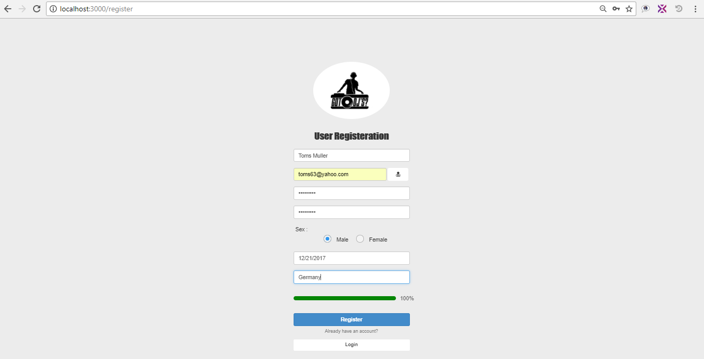
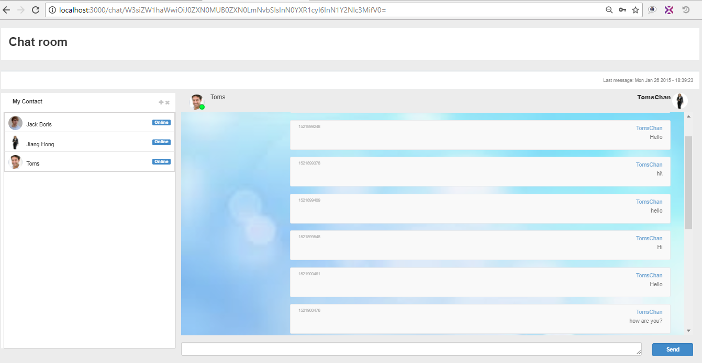

This is Chat application using ReactJS.
I used react as front-end and express as server side.

###  Backend

  - NodeJs.
  -  ExpressJS.
  -  MongoDB.
  -  Nodemailer.
    
###  Frontend

   -  React.
   -  React-router.
   -  Reatstrap 
   -  Sweet alert .
   -  Webpack.
  
How to run this application.

1. Type like this on your Terminal.

   cd ReactChat
   npm install

2. Install mongodb on your computer and run monodb server.
 - on Windows user this guide
   https://www.guru99.com/installation-configuration-mongodb.html#1
 - on Mac
   https://treehouse.github.io/installation-guides/mac/mongo-mac.html
  
3 Install client's side node module.

cd clients & npm install

I used react-route@3.2.0

4. Run servers of backend adn frontend
   npm start.
   cd clients & npm start

### Screens

##Login

##Registration

##Chat

